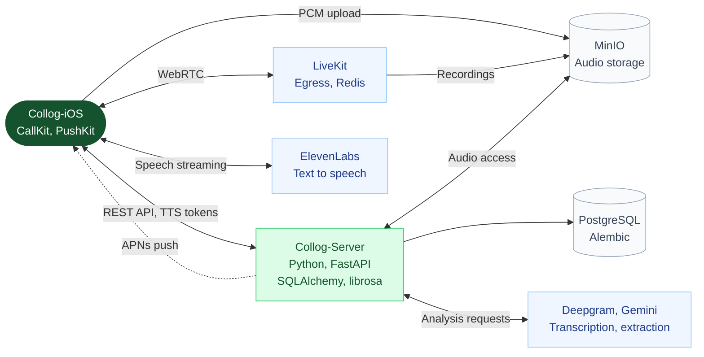

### 콜록 Server

https://testflight.apple.com/join/6DEKfQMw

> 멋쟁이사자처럼대학 14기 중앙해커톤 AAC 트랙 128팀 중 **2위** <br />
> 멋쟁이사자처럼대학 14기 중앙해커톤 317팀 중 **장려상**




### 실행

```bash
cd backend
docker compose --env-file .env --env-file .env.local -f docker-compose.local.yml up -d --build --wait
```

### 문서

- [외부 서버 배포](backend/docs/production-deploy.md)
- [통화 처리](backend/docs/ios-call-flow.md)
- [전사와 정보 추출](backend/docs/ai-transcript-design.md)
- [음향 분석](backend/docs/acoustic-design.md)

<br />
<sub>
© 2026 Team Raichu of LIKELION SeoulTech. All rights reserved.
</sub>
